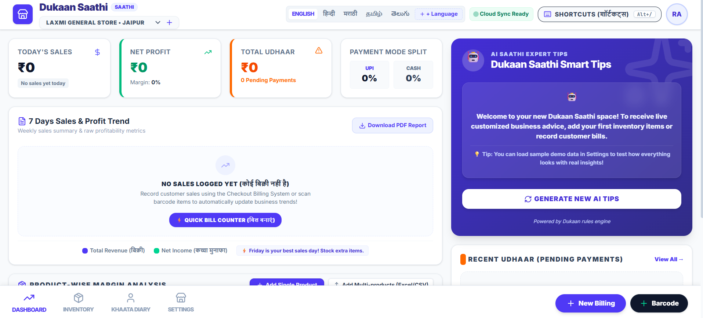
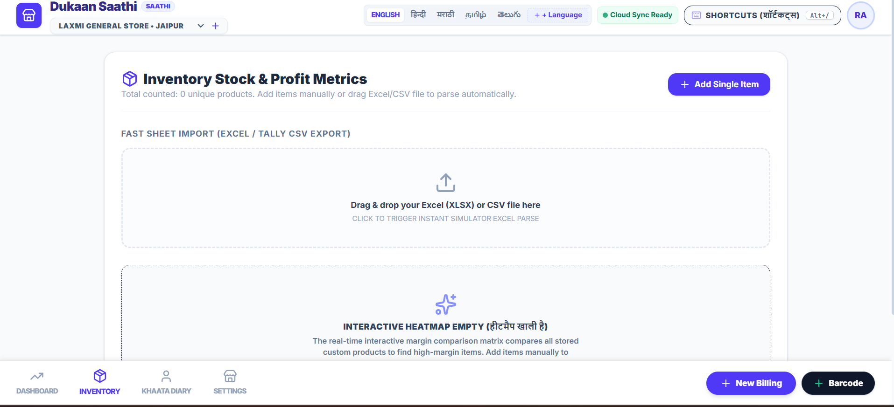
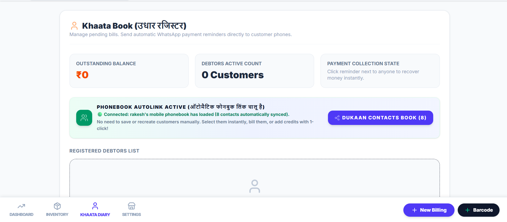

# 🏪 Dukaan Saathi (दुकान साथी)

> *Apni dukaan ka hisaab, apne haath mein.*

## The Problem

Across India, millions of small retail shops — kirana stores, medical shops, stationery counters, general merchants — still run their business on paper notebooks or pure memory. Every day, they write down sales, hand out credit (udhaar), and pay for stock and overheads. But at the end of the day, week, or month, most shopkeepers genuinely don't know:

- **Which products actually make money** — and which ones are quietly losing it
- **Where their money is leaking** — into bad pricing, excess credit, or rising overheads
- **Why sales look healthy but savings don't grow** — because revenue and profit are two very different numbers, and nobody's connecting the dots for them

They have the data — scribbled across notebook pages and in their heads — but no clarity. And the few digital tools available either assume the shopkeeper is already tech-savvy and using billing software, or they only solve one narrow problem (like tracking udhaar) without ever showing the full financial picture.

## The Solution

**Dukaan Saathi** is a simple, bilingual business companion built specifically for small Indian shop owners — including those who have never used a computer for their business before.

The core idea: **the shopkeeper doesn't have to change how they work.** They keep selling the way they always have. Dukaan Saathi just sits alongside that — letting them log a sale, scan a barcode, or import a spreadsheet — and in return, tells them, in plain language and their own tongue:

- Where their profit is actually coming from, product by product
- Where money is leaking — thin margins, stuck credit, rising overheads
- What needs their attention *today*, not buried in a report they'll never open

It's designed to work for both ends of the spectrum: the shopkeeper who manages everything by memory and notebook, and the one who's already comfortable with spreadsheets or billing software — both get the same clarity, in the language they're most comfortable in.

What makes Dukaan Saathi different is that it doesn't stop at collecting numbers — it actually **analyzes every sale and turns it into visual charts 
and product-level breakdowns**, something most small shopkeepers have never had access to before. Instead of a wall of numbers, the shop owner sees 
exactly which products are driving profit and which ones are quietly causing losses, visualized in simple charts they can understand at a glance. 
This is the core insight that helps a small business actually grow — not just knowing *how much* was sold, but knowing *where the profit is coming from and 
where it's leaking*, so the shopkeeper can fix it before it eats into their margins month after month.
# LIVE DEMO OF APP:
live demo-->https://dukaan-saathi-gamma.vercel.app/

## Features

*Built as a single-page React app with all data stored locally in the browser, with optional AI-powered tips and translation via Gemini.*

### Multi-Shop Management
- Create and manage multiple shops under one account
- Switch between shops instantly from the navbar
- Each shop has its own products, sales, and credit (udhaar) records
- Mark a shop as **Manual** (book entry) or **Digital** (spreadsheet import) style

### Onboarding
- First-time setup wizard — shop name, owner name, phone, city
- Choose your working style (manual vs digital) right at signup
- Pick your interface language during onboarding

### Billing & Invoicing
- Quick billing modal — tap products to add them to a cart
- Adjust quantity, choose payment mode (Cash / UPI)
- Mark a bill as **Udhaar (credit)** and link it to a customer
- Generates a printable thermal-style receipt after checkout
- **Live UPI QR code** generated for the exact bill amount (via `api.qrserver.com`)
- One-click **Print** and **WhatsApp Share** of the invoice

### Barcode Scanner (Simulated)
- Scan or type a barcode/item name to find a product instantly
- Auto-adds matched product to the billing cart
- If not found, quickly create a new product on the fly

### Inventory & Product Management
- Add products manually (name, buy price, sell price, stock, unit, barcode, category)
- Drag-and-drop file import simulator for Excel/Tally-style sheets
- **D3.js-powered Profitability Heatmap** — visual grid of all products colored by margin %, filterable by category and sortable by margin/profit/stock
- Click any product tile to see a detailed profit breakdown (rate, margin, potential vs actual profit)
- One-click actions: **Restock +50** for low-stock items, **Auto-set 20% margin price** for thin-margin items
- Low-stock and low-margin items are automatically flagged

### Khaata Diary (Digital Credit Ledger)
- Track all customers with pending (udhaar) balances
- Mark accounts as settled
- Send **WhatsApp payment reminders** with an editable pre-filled message
- **Synced Contacts Book** — simulate importing WhatsApp/Google contacts, link them directly to the credit ledger, or use them to prefill billing

### AI-Powered Smart Tips
- Calls a `/api/tips` endpoint (Gemini-based) to generate contextual business advice from current sales, products, and credit data
- Falls back to built-in rule-based tips (in the selected language) if the AI call fails
- One-click refresh to regenerate tips

### Multi-Language Support
- Built-in: English, Hindi, Marathi, Tamil, Telugu
- **Translate to any language** — type any language name (e.g. Gujarati, Punjabi, Bengali, French) and the app calls `/api/translate-ui` to translate the entire interface using Gemini, then caches it locally
- Quick language switcher in the navbar and onboarding screen

### Reports & Data
- Download a plain-text **monthly business report** (sales, outstanding udhaar, product list)
- **Backup**: export all shops, products, udhaar, and sales history as a JSON file
- **Restore**: re-import a previously exported JSON backup
- **Demo Sandbox**: load sample products/sales/udhaar data to explore the app, or clear all data for a shop

### Keyboard Shortcuts
- `Alt/Ctrl + N` — toggle new invoice
- `Alt/Ctrl + B` — toggle barcode scanner
- `Alt + 1` / `Alt + H` — Dashboard
- `Alt + 2` / `Alt + I` — Inventory
- `Alt + 3` / `Alt + K` — Khaata Diary
- `Alt + 4` / `Alt + S` — Settings
- `Alt + U` / `Alt + C` — Contacts book
- `Alt + /` — Shortcuts help

### Dashboard
- Today's sales, net profit, margin %, outstanding udhaar
- Cash vs UPI payment split
- 7-day sales & profit bar chart
- Product margin analysis table with quick-fix actions
- AI tips panel + recent pending udhaar list

---

##  Tech Stack

- **React 18** with TypeScript
- **D3.js** — profitability heatmap color scales and stats (`d3.scaleLinear`, `d3.mean`, `d3.min`, `d3.max`)
- **Lucide React** — icon set
- **Browser `localStorage`** — all shop data (shops, products, sales, udhaar, contacts, language, settings) persists locally on the device, no database
- **Express server** (`server.ts`) — serves the app via Vite middleware in dev and static `dist/` in production; also hosts two AI API routes
- **Google Gemini API** (`@google/genai` SDK) — powers AI business tips and on-demand UI translation, with automatic model fallback (`gemini-3.1-flash-lite` → `gemini-3.5-flash` → `gemini-flash-latest` → `gemini-3.1-pro-preview`) and exponential backoff retries on transient errors
- **QR Server API** (`api.qrserver.com`) — UPI QR code image generation
- **WhatsApp Click-to-Chat** (`api.whatsapp.com/send`) — reminder and invoice sharing

> Note: This app has no database of its own — all shop data lives in the browser's `localStorage`. The Express backend exists solely to proxy two Gemini-powered API routes (tips and translation) and to serve the built frontend.

### Backend API Routes

| Route | Purpose |
|---|---|
| `POST /api/tips` | Sends current shop stats (sales, profit, udhaar, products) to Gemini and returns exactly 3 structured business tips (`text` + `type`) in the requested language. Falls back to built-in rule-based tips per language if Gemini is unavailable or the API key is missing. |
| `POST /api/translate-ui` | Sends the full English UI label set to Gemini and returns a fully translated JSON map (same keys, translated values) for any language name typed by the user. Placeholders like `{shopName}`, `{amount}`, `{phone}` are preserved untouched. |
| `GET /api/health` | Simple health check, returns server status and timestamp. |

Both AI routes require a `GEMINI_API_KEY` environment variable. Without it, `/api/tips` silently falls back to local rule-based tips, and `/api/translate-ui` returns a 503 error (custom language translation won't work, but the 5 built-in languages still do).

---

##  Running Locally

### Prerequisites
[Node.js (v18+)](https://nodejs.org/)

### 1. Install Dependencies
```bash
npm install
```

### 2. Configure Environment Variables
Create a `.env` file in the project root:
```
GEMINI_API_KEY=your_gemini_api_key_here
PORT=3000
```
Get a free Gemini API key from [Google AI Studio](https://aistudio.google.com/apikey). Without this key, the app still runs fine — AI Tips fall back to rule-based tips, and custom language translation is disabled (the 5 built-in languages still work).

### 3. Run the Development Server
```bash
npm run dev
```
The Express server boots on `http://localhost:3000` and serves the app through Vite middleware with hot reload.

### Build for Production
```bash
npm run build
npm start
```
This builds the frontend into `dist/` and starts the Express server in production mode, serving the static build.

---

##  Data Notes

- All shop data is stored in the browser's `localStorage` — clearing browser data/cache will erase it unless you've downloaded a backup.
- Use **Settings → Backup Data** regularly to download a JSON snapshot of your shops, products, sales, and udhaar records.
- AI Tips work out of the box even without a `GEMINI_API_KEY` (using built-in rule-based fallback tips per language).
- The **"Translate to any language"** feature strictly requires a valid `GEMINI_API_KEY` — without it, this specific feature returns an error, while everything else in the app continues to work normally.

##SCREENSHOTS:








## 📄 License

MIT License. Built for small Indian shopkeepers — सुखी व्यापार! (Wishing you successful trading!)
